# Azure Cloud Governance and Cost Monitoring System

This project demonstrates a simulated implementation of cost governance in Microsoft Azure using various core services and tools such as VM, Storage, Tagging, and Monitoring.

---

# Module 1: Cost Monitoring Report

## 1. Resource Group Created

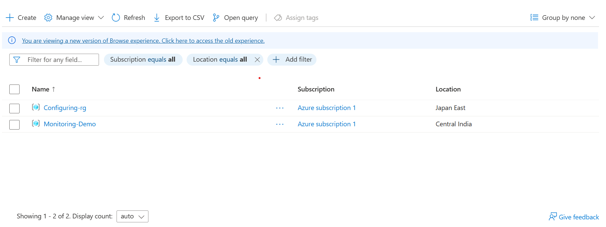

## 2. Storage Account Created

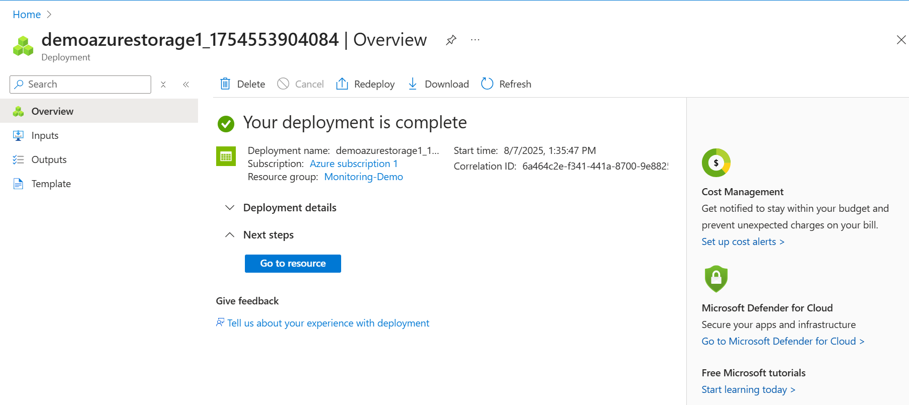

## 3. Virtual Machine Created

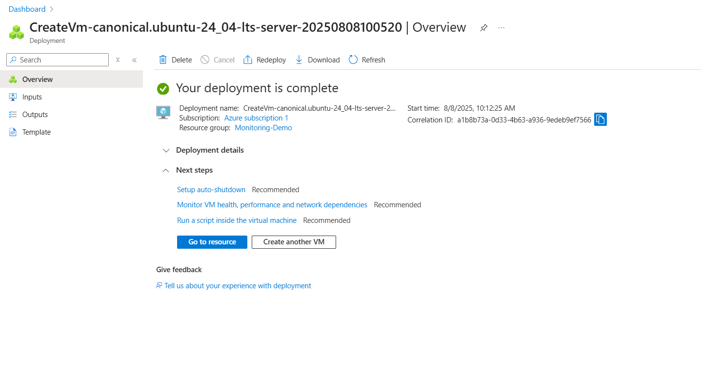

## 4. Tagging Implemented

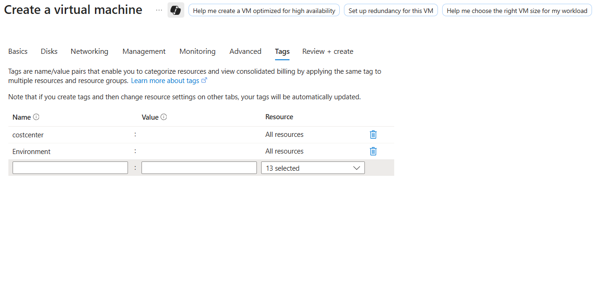

## 5. Cost Analysis Viewed

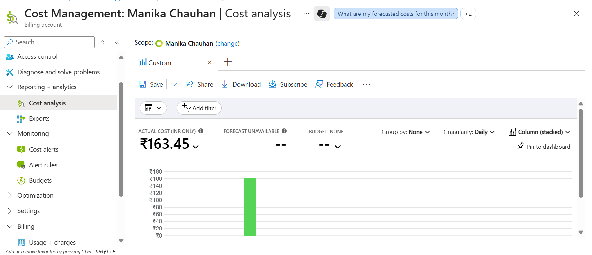

## 6. Budget Created

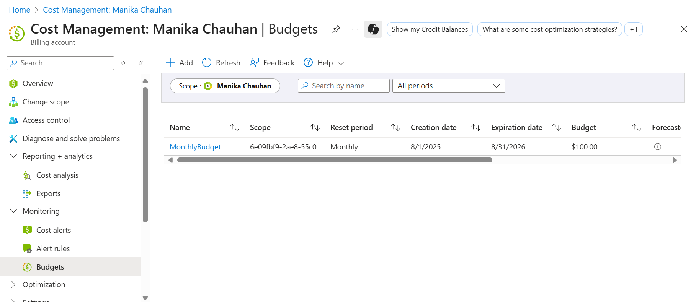

## 7. Budget Alert Enabled

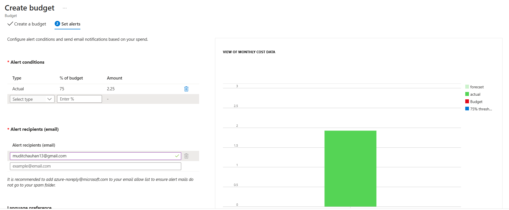

## 8. Azure Advisor Cost Recommendation

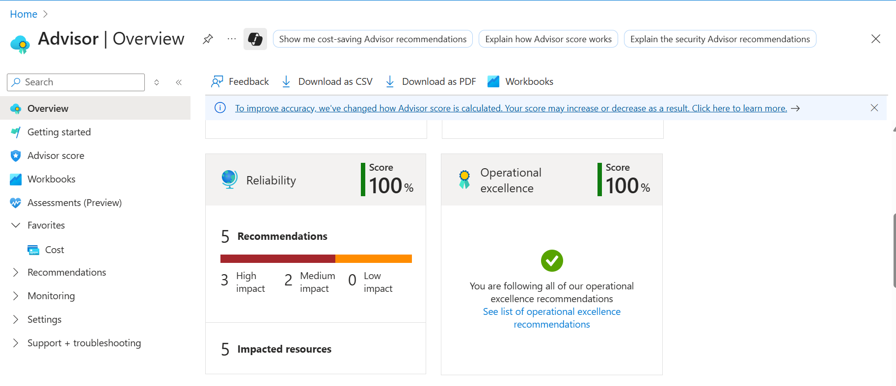

## 9. Custom Dashboard with Cost Tiles

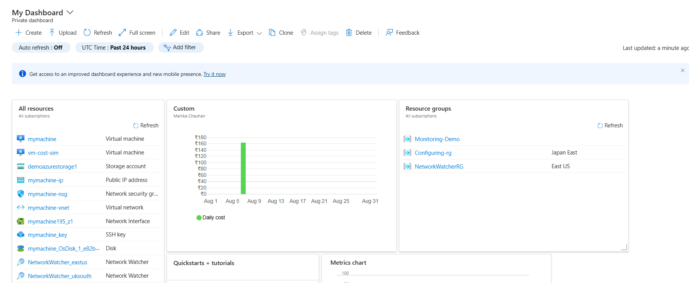

## 10. Pricing Calculator Estimate

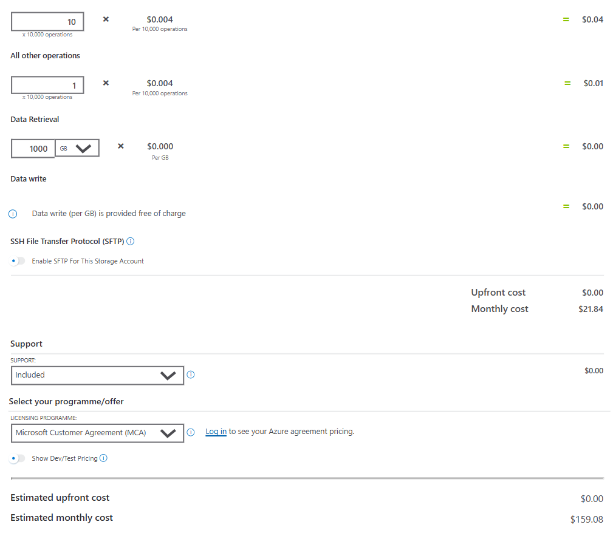

## 11. Final Cost Overview Screenshot

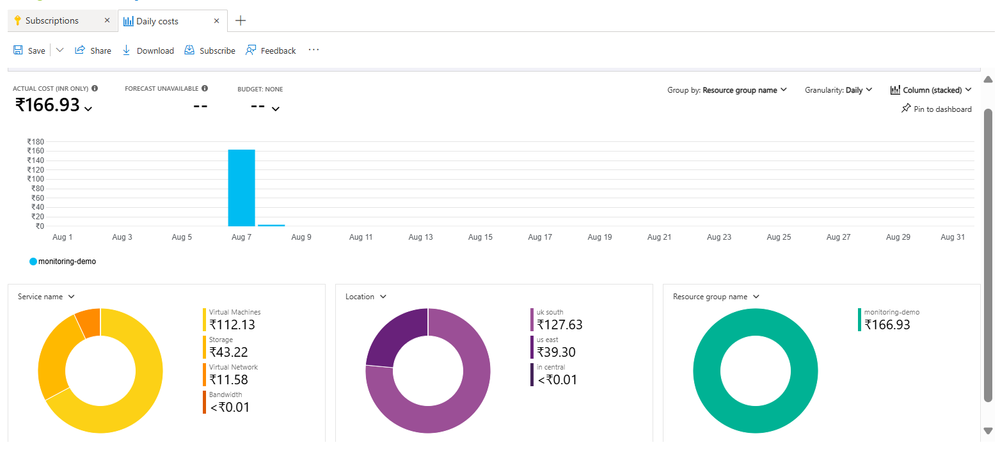

## Conclusion

This mini-project demonstrates how to implement cloud cost governance and monitoring effectively using Azure services, including resource grouping, consistent naming conventions, tagging, budgeting, and cost analysis through dashboards and Azure Advisor.