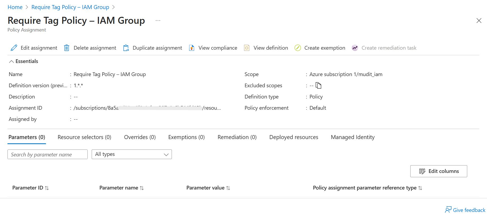

# Module 2: IAM & RBAC Report

## 1. IAM Overview Accessed

## 2. Role Assignments Viewed

## 3. Built-in Role Selected

## 4. Role Definition JSON Viewed

## 5. User Added to Resource Group

## 6. Role Assigned to User

## 7. Group Created for Access Management

## 8. Policy Applied to Group

## 9. Activity Log Verified

## 10. Access Review Performed

## Conclusion
This module demonstrates how to manage Identity and Access in Azure using Role-Based Access Control (RBAC).  
Key activities included viewing IAM settings, selecting built-in roles, checking role definitions in JSON format, adding and assigning users, creating groups, applying governance policies, verifying changes via the Activity Log, and conducting an access review to maintain the principle of least privilege.
