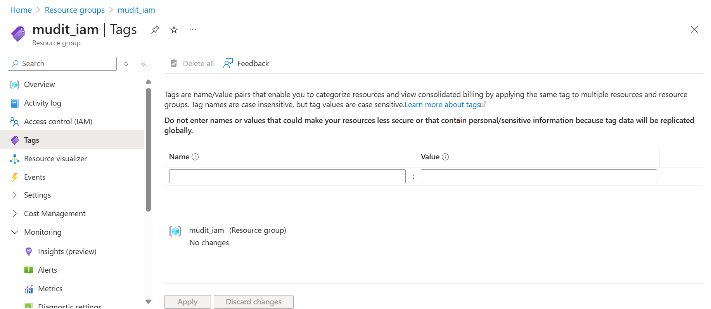

# Module 3: Tagging & Policy Compliance Report

## 1. Tags Page Accessed

## 2. Tag Added via Portal

## 3. Tag Added via CLI

## 4. Policy Assignment Created

## 5. Policy Validation Performed

## 6. Policy Compliance Current

## 7. Resource Compliance Checked

## 8. Cleanup Completed

## Conclusion
This module demonstrates how to manage resource tagging and enforce policy compliance in Azure.  
Key activities included accessing the Tags page, adding tags via the portal and CLI, creating policy assignments, validating policies, checking overall policy compliance, verifying resource-level compliance, and performing cleanup to maintain governance and organizational standards.
