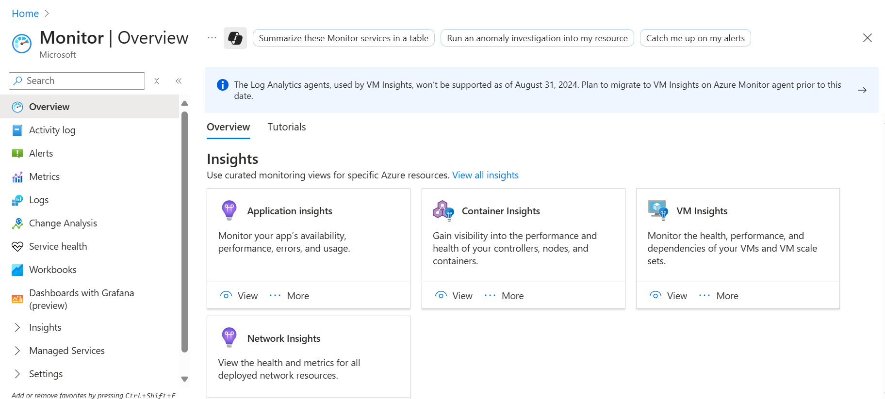
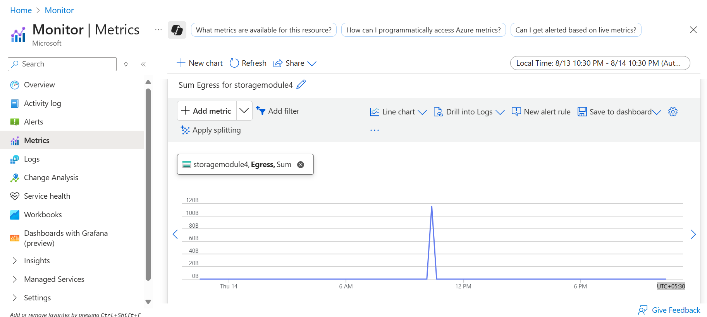
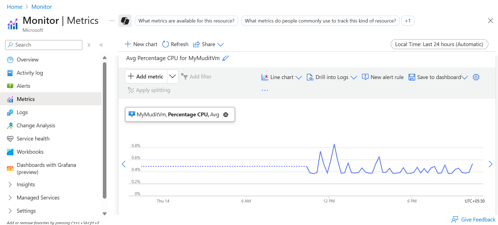
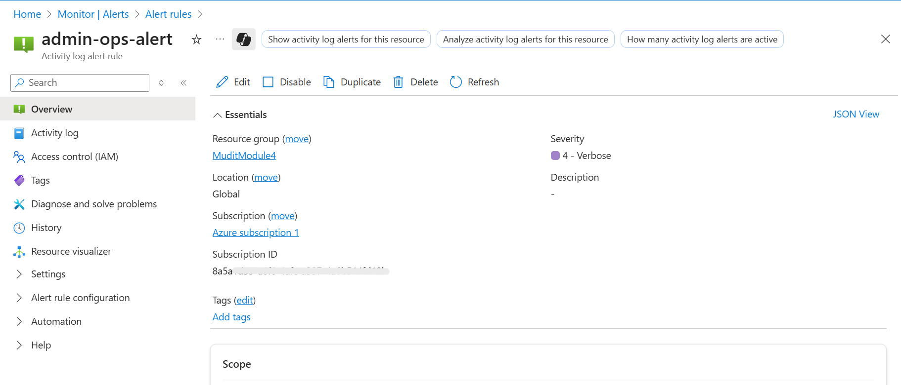
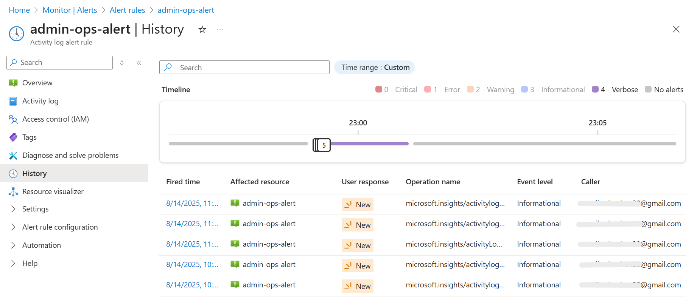

# Azure Cloud Governance and Monitoring System

This module demonstrates monitoring, metrics tracking, and alerting for Azure resources using **Azure Monitor**, including administrative operations tracking, metrics visualization, and alert testing.

---

# Module 4: Azure Monitor & Alerts

## 1. Monitor Overview

This step provides an overview of monitoring options for Azure resources, showing metrics, alerts, and overall health.  

---

## 2. Metrics Explorer

In this step, detailed metrics for selected resources are explored. Users can select a resource, choose a metric namespace, pick specific metrics like CPU Percentage or Disk Read Bytes, and set aggregation and time range to analyze trends.  

---

## 3. Metrics (Signals) Viewed

This step visualizes real-time and historical performance data for the selected resource. Signals show how the resource performs over time. Optional splitting allows breakdown by dimensions like disks or network adapters.  

---

## 4. Administrative Operations Alert Rule Created

An alert rule is created to notify automatically when administrative operations are performed on the selected resource. This includes operations like starting, stopping, or restarting a VM. Users configure the scope, condition (Activity Log → Administrative Operations), action group, alert name, and severity.  

---

## 5. Administrative Operations Alert Triggered

After performing an administrative operation (e.g., stopping or restarting the VM), the alert is triggered and appears in the **Alert History**. This confirms the alert rule is working correctly.  

---

## Conclusion

This module demonstrates how to implement monitoring and alerting for Azure resources using **Azure Monitor**, including:  

- Tracking and visualizing resource metrics.  
- Creating alert rules for administrative operations.  
- Testing and verifying alerts in real time.  

It provides a practical workflow for governance and monitoring in Azure environments.
