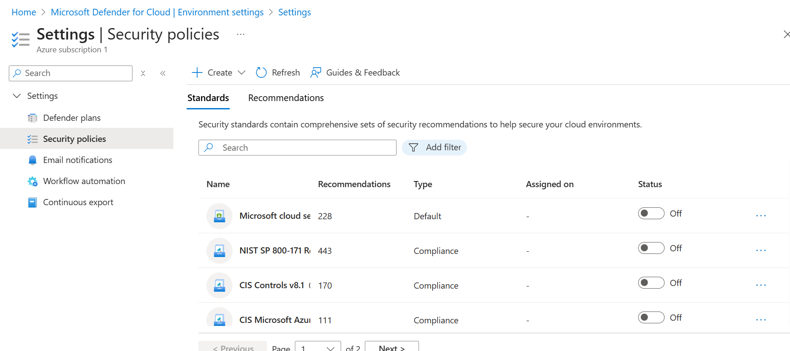
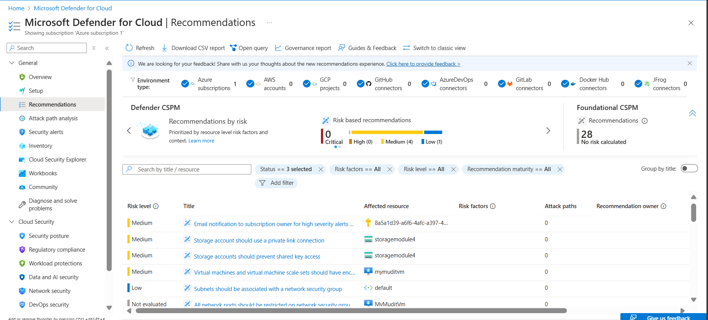
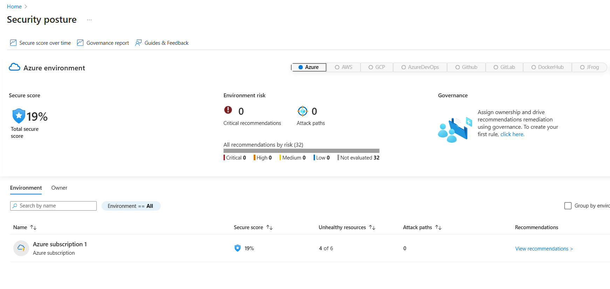
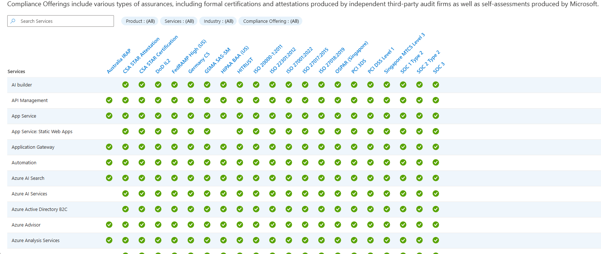
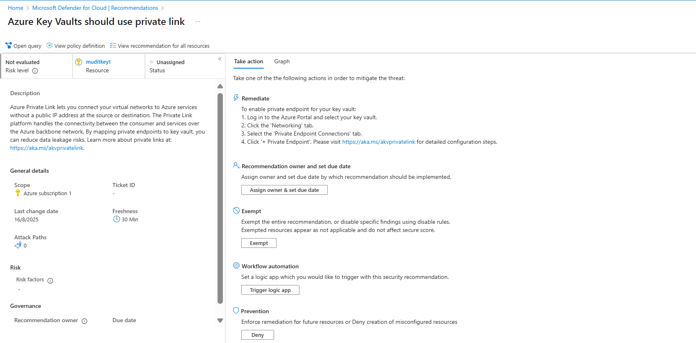
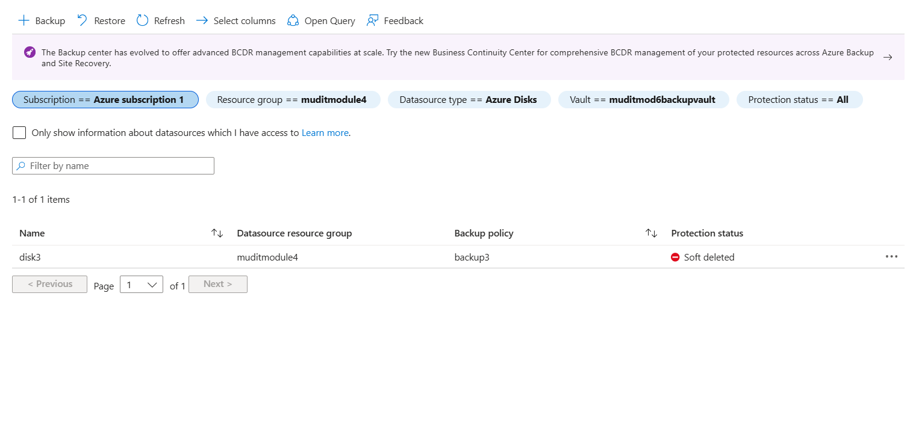
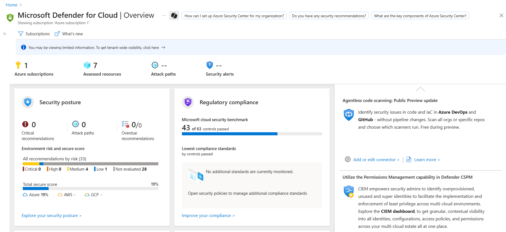

# Module 5: Security and Compliance Report 

## 1. Policy Overview

## 2. Recommendations

## 3. Secure Score

## 4. Compliance Assessment

## 5. Remediation Recommendation

## 6. Backup Status

## 7. Final Dashboard

## Conclusion

This module highlights the importance of **backup governance and compliance** within Azure. By using policies, secure score monitoring, compliance assessments, and remediation actions, organizations can ensure that their storage accounts and backup configurations follow best practices. The final dashboard provides a consolidated view of storage security and backup status for effective cloud governance.
