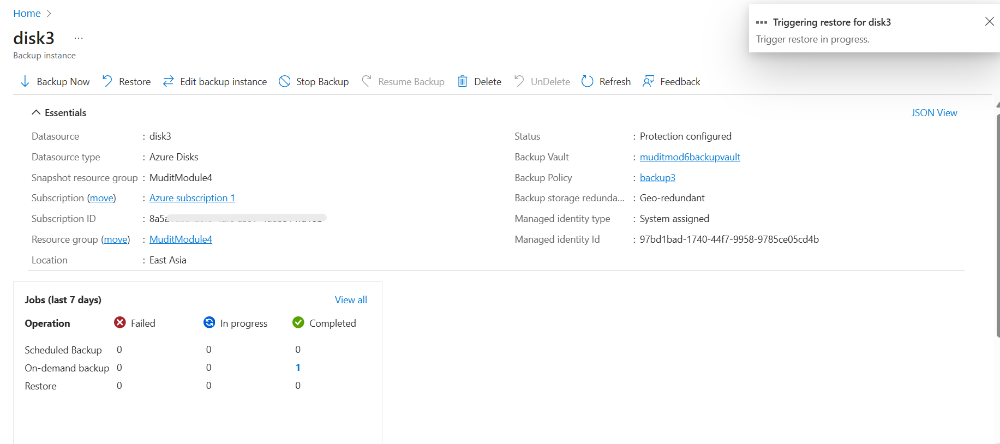

# Module 6: Storage Backup Report

## 1. Create Storage Account

## 2. Redundancy Options

## 3. Create Backup Vault

## 4. Backup Policy Creation

## 5. Assign Policy

## 6. On-Demand Backup

## 7. Simulate Restore

## 8. Verify Cleanup

## Conclusion

This module covers the **end-to-end process of implementing backup for Azure Storage**.  
It includes creating a storage account, selecting redundancy options for resilience, creating a backup vault, and configuring backup policies. Policies are then assigned and tested using **on-demand backup** and **restore simulation**.  
Finally, cleanup verification ensures that resources are properly managed.  
This module demonstrates how organizations can ensure **data protection, disaster recovery readiness, and compliance** through Azure Backup.
