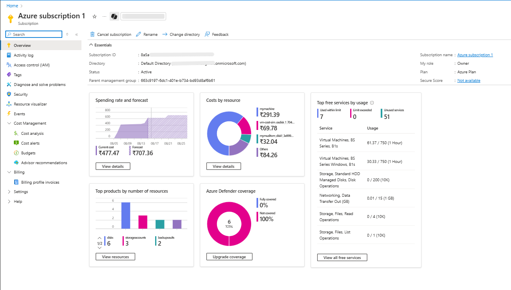
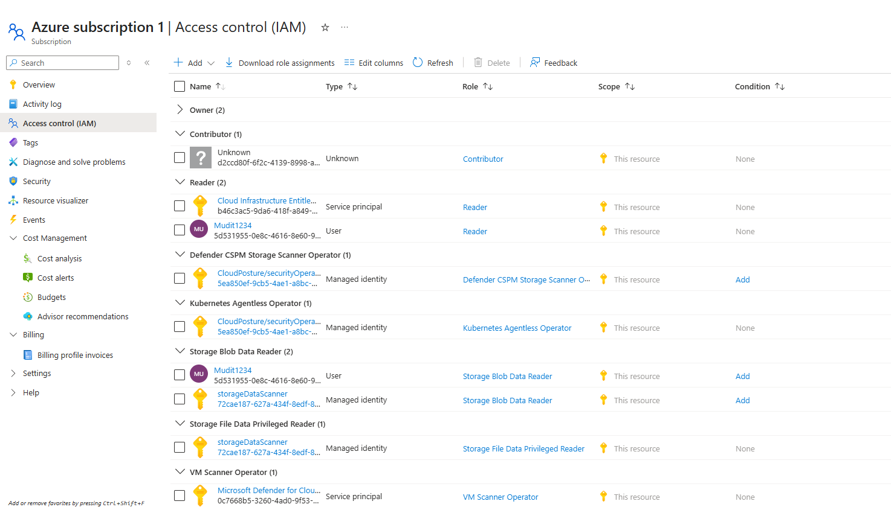
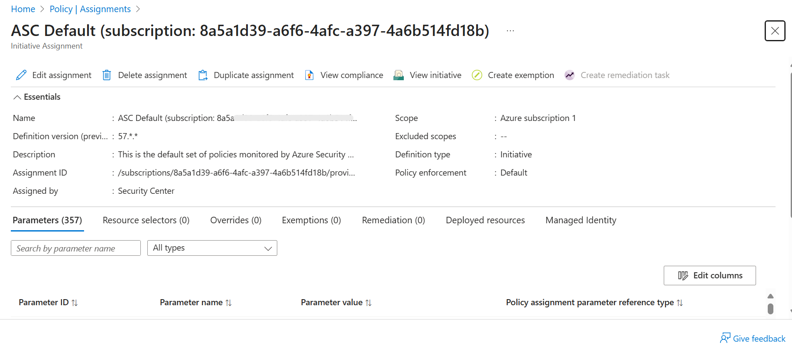
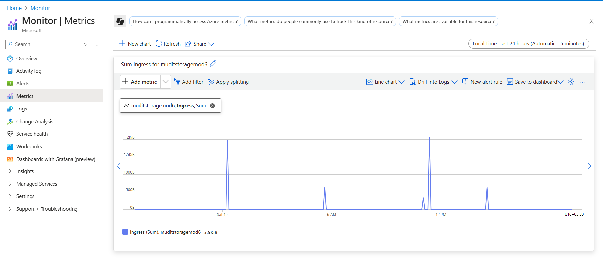
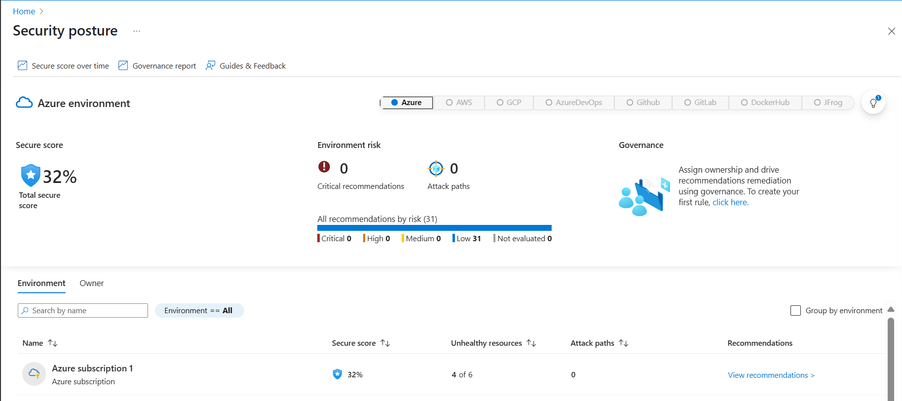
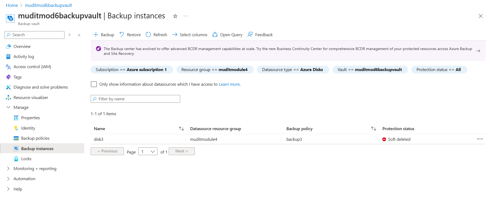

# Module 7: Azure Dashboard Report

## 1. Cost Monitoring
  
Shows subscription-level cost overview, top-spending resources, Azure Defender coverage, and cost forecast trends.

---

## 2. IAM / RBAC
  
Shows all users and their assigned roles in the subscription, highlighting privileged accounts for governance compliance.

---

## 3. Tagging and Resource Organization
  
Only default tagging policy present. Custom tags were not applied; tagging compliance can be enforced via policies in future.

---

## 4. Monitor and Alerts
  
Shows subscription resource health, monitoring metrics, and active alerts for proactive governance.

---

## 5. Security and Compliance
  
Shows overall Secure Score, top security recommendations, and compliance posture of subscription resources.

---

## 6. Storage and Backup
  
Shows backup instances with assigned policies. Protection status is currently ‘Soft Deleted’ for some backup instances, which can be recovered if needed.

---

## 📄 Conclusion
This module consolidates **Azure governance, monitoring, and security insights** into a single dashboard.  
It covers cost monitoring, IAM governance, tagging compliance, proactive monitoring, security posture, and backup protection.  

The **Azure Dashboard Report** provides a unified view of resource health, compliance, and resilience — essential for **cloud governance, cost optimization, and security readiness**.  

---

## 📥 Download Full Report
👉 [Download the complete PDF here](../Module7_AzureDashboard.pdf)  
*(Note: GitHub preview may not show Module 6, but it will appear correctly when you download and open the PDF locally.)*
